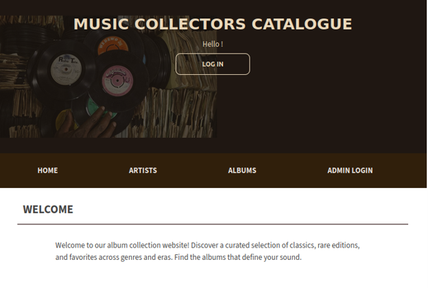
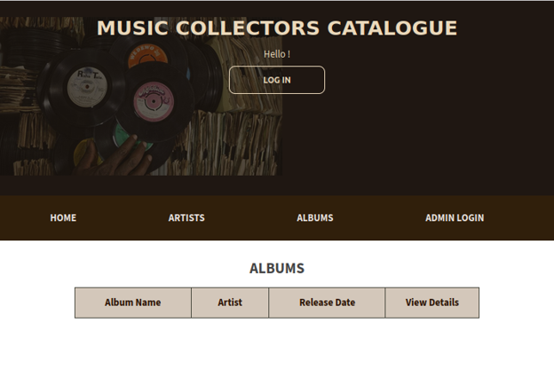
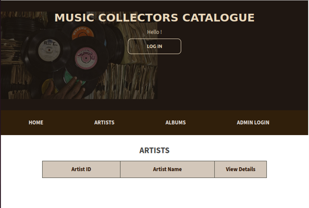
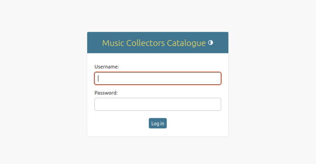

# ♯ Music Catalogue


> BCDE215 - Web Development
>
> Music Catalogue is a web-based catalogue management app built with **Django** and **MySQL**, developed as part of the **BCDE215 - Web Development** course at Ara Institute of Canterbury. It allows users to browse a collection of music albums and songs, while providing administrators with full CRUD control over the catalogue.

🔗 **Live Demo:** *(link to be added)*
&nbsp;·&nbsp;
📖 **[Wiki — Full Local Setup Documentation](https://github.com/arseniedev/music-catalogue/wiki)**

---

## ✨ Core Features

**Public browsing**
- View all albums and their associated songs
- Browse by artist, genre, or release year

**Admin Panel (login required)**
- Secure admin login via Django's built-in authentication
- **Create** new albums and songs
- **Read** — browse and search the full catalogue
- **Update** existing album and song details (title, artist, year, cover art, track listing, etc.)
- **Delete** albums or individual songs from the catalogue
- Manage collections — group albums into curated sets

> See the [Wiki](https://github.com/arseniedev/music-catalogue/wiki) for full admin usage instructions and data model details.

---

## Snapshots

<table>
  <tr align="center">
    <td>Homepage</td>
    <td>Album Home</td>
    <td>Artist Home</td>
  </tr>
  <tr align="center">
    <td></td>
    <td></td>
    <td></td>
  </tr>
  <tr>
  <tr align="center">
    <td>Admin Sign In</td>
    <td>Edit Album Details</td>
    <td>Edit Artist Details</td>
  </tr>
  <tr align="center">
    <td></td>
    <td></td>
    <td></td>
  </tr>

  
</table>

---

## Project Structure
<!-- START_STRUCTURE -->
```text
.
├── README.md
├── app
│   ├── __init__.py
│   ├── admin.py
│   ├── apps.py
│   ├── assets
│   ├── forms.py
│   ├── migrations
│   ├── models.py
│   ├── tests.py
│   ├── urls.py
│   └── views.py
├── docs
│   └── snapshots
├── manage.py
├── music_catalogue
│   ├── __init__.py
│   ├── asgi.py
│   ├── settings.py
│   ├── static
│   ├── urls.py
│   └── wsgi.py
├── requirements.txt
├── staticfiles
│   ├── admin
│   ├── images
│   └── stylesheet.css
├── structure.txt
└── templates
    ├── music_catalogue
    └── registration

14 directories, 18 files
```
<!-- END_STRUCTURE -->
---

## Local Setup 
[See Wiki](https://github.com/arseniedev/music-catalogue/wiki) ⊿


## 🔮 Future Improvements

- Search and filter by genre, artist, or year
- User accounts with personalised playlists
- Album cover image uploads
- REST API endpoint for external integrations
- Spotify / MusicBrainz metadata auto-fill

</br>

---

</br>

> 
>
> #### **BCDE215 - Web Development**
>
> This portfolio contains original work completed as part of my BCDE215 - Web Development course at Ara Institute of Canterbury. I do not condone plagiarism or academic misconduct in any form. This project is for academic purposes only and is not intended to be copied or used without proper authorisation.
> The university has a <span style="color:brown;">**STRICT**</span> policy on academic misconduct, and I fully support this policy. Any attempt to plagiarize, copy, or use this work as your own will result in serious consequences. Please respect academic integrity and do not attempt to pass off this work as your own.
>
> #### **Disclaimer**
>
> All the content presented here is the result of my own individual work, and any resemblance to other works is purely coincidental. If you are a student, please refrain from using or copying this work in any way that violates the principles of academic honesty and integrity.

---

Created by Arsenie — 2024
